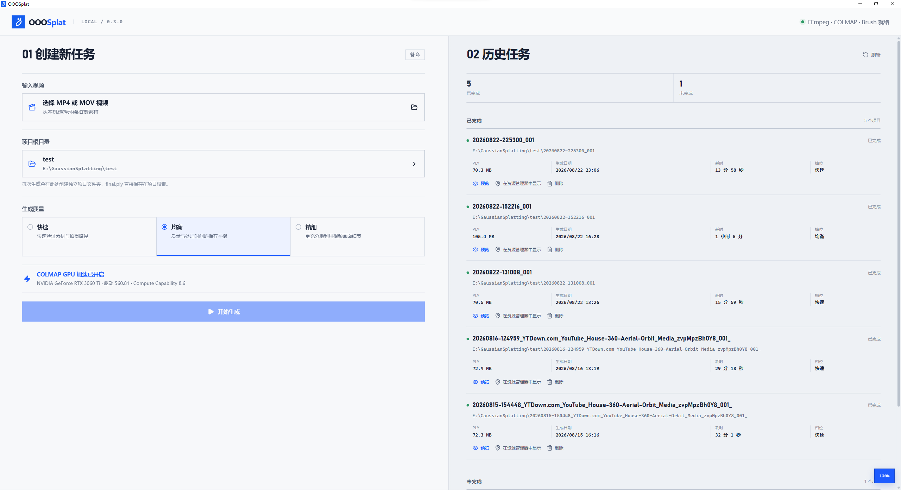
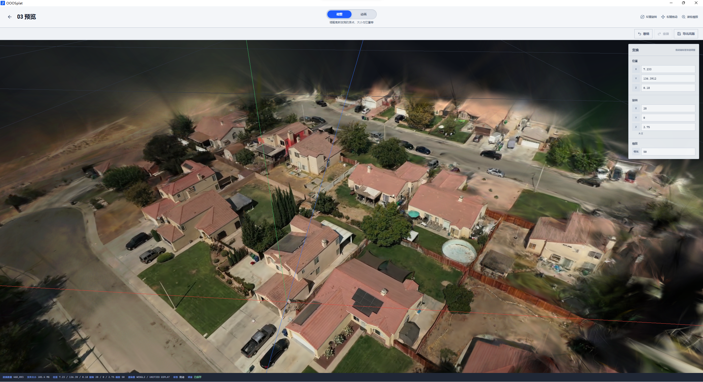

# OOOSplat

[中文](README.md) | [English](README_EN.md)

<p align="center">
  
</p>

OOOSplat 是一款将普通环绕拍摄视频一键转换为 3D Gaussian Splatting 的本地 Windows 桌面应用。选择视频、项目目录和质量档位后，应用会自动完成抽帧、相机重建、训练与 PLY 发布，并可直接预览、调整和导出结果。

FFmpeg、FFprobe、COLMAP（CUDA 构建）和 Brush 随安装程序提供，用户无需配置系统 `PATH` 或单独安装原生引擎。整个生成流程使用本机 CPU 和 GPU，输入素材、工程文件、模型与日志无需上传到云端重建或训练服务。源码仓库不保存这些大型引擎二进制文件，而是通过固定来源和 SHA-256 在构建前恢复。

当前版本：**0.3.0**

查看 [OOOSplat Roadmap](ROADMAP.md) 了解后续规划。

> 当前版本可从视频生成并管理 `final.ply`，并在应用内完成 Gaussian Splat 预览、整体 Transform 编辑、动画预览以及非破坏式导出。

## 核心优势

- **一键生成高斯泼溅**：只需选择输入视频、项目目录和质量档位，即可自动完成 FFmpeg 抽帧、COLMAP 相机重建、Brush 训练和 `final.ply` 发布，无需手动拼接命令或配置引擎。
- **安全可控**：素材、抽帧、重建数据、模型和日志默认只保存在用户选择的本地项目目录，无需上传云端；Transform 与导出采用非破坏式流程，不覆盖原始 `final.ply`。
- **完全本地化算力**：重建与训练均在用户自己的电脑上运行，不调用远程计算服务。满足要求时 COLMAP 自动使用本机 NVIDIA GPU 加速，否则回退 CPU，过程和数据始终由用户掌控。

## 界面预览

### 创建与管理任务



### 高斯泼溅预览与调整



## 主要功能

- 从 MP4、MOV 视频创建 Gaussian Splatting 项目。
- 自动完成视频分析、均匀抽帧、特征提取、顺序匹配、相机重建、Brush 训练和 PLY 发布。
- FFmpeg、FFprobe、COLMAP（CUDA 构建）和 Brush 随安装包提供。
- COLMAP 会自动检查内置 CUDA 运行时、NVIDIA 驱动版本和显卡 Compute Capability，满足要求时使用 GPU 加速特征提取与匹配，否则自动回退到 CPU。
- 实时显示处理阶段、引擎输出、关键计数、累计耗时和最多 500 条界面日志。
- 原始进程输出完整写入项目的 `logs` 目录。
- 支持取消任务，并通过 Windows Job Object 终止整个子进程树。
- 支持自定义项目根目录，默认位置为 `Documents\SplatStudio\Projects`。
- 自动记录已完成、失败、中断和取消的历史任务。
- 在“03 预览”中直接加载历史项目的 `.ply`，支持 Orbit、Pan 和 Zoom；“调整 / 动画”双模式切换不会重新加载模型或重置相机。
- 调整模式支持整个 Gaussian 模型的位置、旋转、等比缩放，以及撤销 / 重做。
- Transform 自动保存到 `project.json`；导出生成 `edited.ply`、`edited-2.ply` 等新文件，不覆盖原始 `final.ply`。
- 动画模式依次播放 5 秒显现、8 秒冲击波和持续相机环绕，并可导出带 OOOSplat 水印的 1080×1920、30 fps、23 秒 H.264 MP4。
- 可在资源管理器中定位 `final.ply`，或将整个项目移入 Windows 回收站。
- 可拖动中央分界线调整左右面板宽度；右下角支持 80%–140% 整体界面缩放。
- 支持中文、空格、长文件名和 UNC 项目路径。

## 处理流程

```text
输入视频
  │
  ├─ FFprobe：读取时长、分辨率、帧率和总帧数
  ├─ FFmpeg：按照质量档位均匀抽取画面
  ├─ COLMAP：自动选择 CPU 或 CUDA GPU 进行特征提取与顺序匹配
  ├─ COLMAP：增量重建并验证注册率和三维点
  ├─ Brush：使用可用 GPU 训练 Gaussian Splats
  └─ 校验 PLY 后原子发布为 final.ply
```

COLMAP 注册图像比例低于 50% 时任务停止；50%–80% 时给出质量警告并继续；达到 80% 时视为正常。

## 系统要求

- Windows 10 或 Windows 11，x64。
- 支持 WebView2 Runtime。
- 视频导出需要 WebView2 提供 WebCodecs AVC 编码能力；不支持时仍可在“动画”模式播放效果，但“导出视频”会显示不可用原因。
- Brush 训练需要可用的 GPU 图形后端，建议使用独立显卡。
- COLMAP 的 CUDA 加速需要 NVIDIA 显卡、Windows 驱动 528.33 或更高版本，以及 Compute Capability 5.0 或更高版本；不满足要求时程序会自动使用 CPU，无需用户配置。
- 项目磁盘需要容纳源视频副本、抽帧图像、COLMAP 数据、Brush 中间文件和最终 PLY。长视频或精细档位可能占用大量空间。
- 安装模式为整机安装，安装时可能需要管理员权限。

COLMAP 使用同时支持 CPU 与 CUDA GPU 的构建，运行前会自动选择可用后端；Brush 训练使用可用 GPU 图形后端，二者的 GPU 检测与运行机制相互独立。

## 安装与使用

1. 运行 OOOSplat安装包 完成安装。
2. 启动 OOOSplat，确认顶栏中的内置引擎状态正常。
3. 在“01 创建新任务”中选择输入视频。
4. 选择项目根目录；程序会记住上次使用的位置。
5. 选择“快速”“均衡”或“精细”档位。
6. 查看自动检测到的 COLMAP 加速状态及原因，然后点击“开始生成”。
7. 在左侧查看实时阶段、指标和日志；完成后，在“02 历史任务”中查看项目并点击“预览”。
8. 在“03 预览”的“调整”模式中修改模型，Transform 会自动保存；点击“导出高斯”生成新的 edited PLY。
9. 切换到“动画”可查看竖屏构图并重新播放效果；点击“导出视频”会在项目目录生成 23 秒竖屏 MP4。

使用提示：

- 拖动左右面板之间的分界线可以调整宽度；双击分界线恢复默认比例。
- 点击右下角百分比按钮可缩小、恢复或放大整个界面。
- 任务运行期间不可修改视频、项目目录和质量档位。
- 点击“删除”会回收整个项目目录，包括源视频副本和所有中间文件；如果移入回收站失败，程序不会降级为永久删除。

## 质量档位

| 档位 | 保留画面 | FFmpeg 抽帧率 | Brush iterations | 最大训练分辨率 |
| --- | ---: | ---: | ---: | ---: |
| 快速 | 30% | 源视频 FPS × 0.30 | 8,000 | 1,200 |
| 均衡 | 50% | 源视频 FPS × 0.50 | 15,000 | 1,600 |
| 精细 | 100% | 源视频 FPS × 1.00 | 30,000 | 2,000 |

抽帧由 FFmpeg 完成，COLMAP 不负责减少帧数。程序不设置最大抽帧数量，也没有额外的 Splat 数量上限；最终 Splat 数量由素材、重建结果和 Brush 训练过程决定。

## 项目与文件位置

每次生成都会在项目根目录下创建一个独立文件夹：

```text
<项目根目录>\<yyyyMMdd-HHmmss_视频名>\
  final.ply             最终 Gaussian Splatting 文件
  project.json          项目元数据与结果指标
  edited.ply            首次非破坏式 Transform 导出（可选）
  edited-2.ply          后续导出自动编号（可选）
  preview.mp4           首次动画预览视频导出（可选）
  preview-2.mp4         后续视频导出自动编号（可选）
  state.json            流水线状态
  source\
    input.<ext>         源视频副本
  work\
    frames\             FFmpeg 抽取的画面
    colmap\             COLMAP 数据库与稀疏重建
    brush\              Brush 数据集与训练中间文件
  logs\                 FFmpeg、COLMAP、Brush 等完整日志
```

项目名中的 Windows 非法字符会被清理；发生重名时自动追加 `-2`、`-3` 等后缀。

应用设置和项目索引保存在：

```text
%LOCALAPPDATA%\SplatStudio\settings.json
%LOCALAPPDATA%\SplatStudio\project-index.json
```

## 内置引擎

| 引擎 | 固定版本/构建 | 用途 |
| --- | --- | --- |
| FFmpeg / FFprobe | 8.1 系列 Windows x64 LGPL shared | 视频分析与抽帧 |
| COLMAP | 4.0.4 发布资产，CUDA 构建 | 自动选择 CPU/CUDA GPU 完成特征与匹配，并执行相机重建 |
| Brush | v0.3.0 Windows x64 | Gaussian Splatting 训练与 PLY 导出 |

详细来源、实际版本、下载与安装规则、压缩包哈希和可执行文件哈希记录在 [`engines/manifest.json`](engines/manifest.json)。大型引擎文件不会提交到 Git；开发者通过 `npm run setup:engines` 下载并恢复到本地。Release 打包前会运行校验；文件缺失、哈希变化、COLMAP CUDA 运行时缺失或 Brush CLI 参数不符合预期时，打包会被阻止。

第三方许可和通知位于 [`licenses/`](licenses/)：

- FFmpeg：LGPL-2.1-or-later，本项目选用的构建禁用 GPL/nonfree 组件。
- COLMAP：BSD-3-Clause。
- Brush：Apache-2.0。

## 本地开发

### 开发环境

- Node.js 22.12 或更高版本。
- Rust stable，目标为 `x86_64-pc-windows-msvc`。
- Visual Studio 2022 Build Tools，包含 Desktop development with C++。
- Tauri 2 所需的 WebView2 开发/运行环境。

安装依赖并启动开发模式：

```powershell
npm install
npm run setup:engines
npm run tauri -- dev
```

### 测试与检查

```powershell
# 前端测试
npm test

# 前端生产构建
npm run build

# Rust 测试
cargo test --manifest-path src-tauri\Cargo.toml

# Rust 静态检查
cargo clippy --manifest-path src-tauri\Cargo.toml --all-targets -- -D warnings

# 校验内置引擎版本、哈希和 COLMAP CUDA 运行时
npm run verify:engines

# 校验第一方许可、第三方通知及安装包资源映射
npm run verify:licenses
```

### 生成 Windows 安装包

```powershell
npm run tauri -- build
```

NSIS 安装包输出到：

```text
src-tauri\target\release\bundle\nsis\OOOSplat_0.3.0_x64-setup.exe
```

首次构建前必须运行 `npm run setup:engines`。`beforeBuildCommand` 会自动执行引擎校验和前端生产构建，但不会在打包过程中隐式访问网络。

## CLI

仓库同时提供 `splatstudio` 诊断 CLI：

```powershell
# 检查所有内置引擎
cargo run --manifest-path src-tauri\Cargo.toml --bin splatstudio -- health

# 读取视频信息
cargo run --manifest-path src-tauri\Cargo.toml --bin splatstudio -- probe "D:\Videos\orbit.mp4"

# 查看抽帧计划但不写出画面
cargo run --manifest-path src-tauri\Cargo.toml --bin splatstudio -- plan "D:\Videos\orbit.mp4" --quality balanced

# 单独抽帧
cargo run --manifest-path src-tauri\Cargo.toml --bin splatstudio -- extract "D:\Videos\orbit.mp4" "D:\Frames" --quality fast

# 运行完整流水线（自动检测并选择 COLMAP GPU 或 CPU）
cargo run --manifest-path src-tauri\Cargo.toml --bin splatstudio -- generate "D:\Videos\orbit.mp4" --projects-root "D:\Splat Projects" --quality balanced
```

开发或诊断时可以通过全局参数 `--engine-dir <路径>`，或环境变量 `OOOSPLAT_ENGINE_DIR`，覆盖默认引擎目录。

## 常见问题

### 如何让 COLMAP 使用显卡？

无需手动选择。应用会检查内置 COLMAP CUDA 运行时、NVIDIA 驱动版本和显卡 Compute Capability，满足要求时自动使用 GPU 加速特征提取与匹配，否则自动回退到 CPU。当前最低要求为 Windows 驱动 528.33、Compute Capability 5.0；实际检测结果和未启用原因会显示在“01 创建新任务”中。

### 为什么任务在相机重建后停止？

通常是相机注册率低于 50%。建议使用曝光稳定、画面清晰、运动连续、视角重叠充分的环绕拍摄视频，避免快速转动、强反光、大面积纯色和运动物体。

### 为什么项目占用空间很大？

每个项目会保留源视频副本、抽帧、COLMAP 数据和 Brush 中间文件，便于诊断和追溯。确认结果后，可通过历史任务中的“删除”将整个项目移入回收站。

### 可以直接在应用中查看 final.ply 吗？

可以。在“02 历史任务”中选择已完成项目并点击“预览”，即可在独立预览工作区浏览 `.ply`。“调整”模式用于编辑整个模型的位置、旋转和等比缩放；“动画”模式提供 5 秒显现、8 秒冲击波、持续环绕以及带水印的竖屏 MP4 导出。当前不支持单个 Gaussian 选择、删除、裁剪或清理；`.sog` 和 `.spz` 也尚未开放。

## 技术栈

- 桌面框架：Tauri 2
- 后端：Rust、Tokio
- 前端：React 19、TypeScript、Vite、Zustand
- Gaussian 预览与动画：PlayCanvas Engine、PlayCanvas React
- 视频编码与封装：WebCodecs、Mediabunny
- 原生流水线：FFmpeg / FFprobe、COLMAP、Brush
- Windows 进程管理：Job Object

## 许可说明

### 代码许可

OOOSplat 的第一方代码及随附文档以 [Apache License 2.0](LICENSE) 发布。版权声明见 [NOTICE](NOTICE)。

### 第三方组件

FFmpeg / FFprobe、COLMAP、Brush、PlayCanvas 和 Mediabunny 分别适用其自身许可证，不因与 OOOSplat 一同分发而改用 Apache-2.0。直接组件的版本、来源、许可证和许可证正文入口见 [第三方通知](licenses/THIRD_PARTY_NOTICES.txt) 与 [引擎清单](engines/manifest.json)。该清单不表示已经完成 Qt、Boost、Ceres 等传递依赖的完整许可审计。

### 品牌

Apache-2.0 不授予 “OOOSplat” 名称、Logo、图标或其他视觉标识的商标使用权。真实引用、教程、截图、官方未修改版本分发及修改版命名规则见 [OOOSplat Trademark Policy](TRADEMARK_POLICY.md)。

### 生成模型

`final.ply` 等生成结果不会仅因使用 OOOSplat 而自动适用 Apache、GPL、LGPL 或其他随附软件许可证。该说明不判断模型著作权归属，也不授予输入素材或第三方内容的权利；完整边界见 [Generated Outputs](GENERATED_OUTPUTS.md)。
